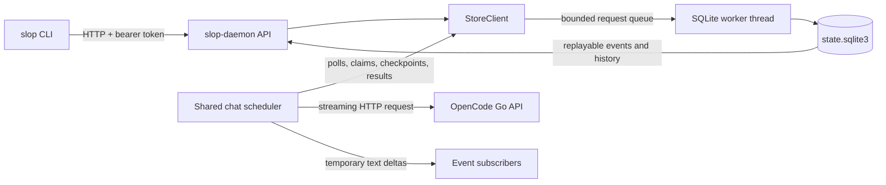

# Understanding `slop-daemon`

This guide follows the code that exists today. The short version is: **the daemon is the local service that owns sessions, accepts commands over HTTP, saves their durable state, and coordinates model calls.** Clients such as `slop` are replaceable remote controls. They do not own a conversation or call the model themselves.

The current daemon runs on one machine, listens on loopback, stores its authoritative data locally, and executes text chat with OpenCode Go. Coding tools, worktrees, remote access, session replication, and graphical clients are later work.

## The map



The daemon composes several crates; it is not the whole product:

| Piece | Responsibility |
| --- | --- |
| [`slop-daemon`](crates/slop-daemon/src/main.rs) | Start and stop the service, expose HTTP routes, authenticate requests, own the data directory, and connect storage, credentials, and runtime. |
| [`slop-protocol`](crates/slop-protocol/src/lib.rs) | Public JSON request/response types and API version. These types do not contain SQL or provider implementation details. |
| [`slop-runtime`](crates/slop-runtime/src/chat.rs) | Shared turn scheduler, streaming model requests, cancellation polling, and runtime provider integration. |
| [`slop-client`](crates/slop-client/src/lib.rs) | HTTP client used by native frontends. |
| [`slop-cli`](crates/slop-cli/src/main.rs) | Command-line parsing and terminal/JSON presentation. |

`slop-daemon` implements the runtime's `ChatRepository` boundary for SQLite. The runtime can ask to claim work, save visible text, check cancellation, and finish a turn without knowing the wire DTOs or SQL schema. Conversely, the API handlers call `StoreClient`; they do not manipulate SQLite directly.

## Concepts to keep straight

| Name | Meaning |
| --- | --- |
| **Node** | This daemon and its machine identity. The node ID is created once and stored in SQLite. |
| **Session** | A durable conversation configuration: owner node, provider/model, optional title, token cap, revision, and event high-water mark. |
| **Turn** | One accepted user message and the daemon's attempt to produce an assistant reply. A turn has its own ID and lifecycle status. |
| **Message** | A user or assistant entry belonging to a turn. Assistant text can first appear as an explicitly incomplete checkpoint. |
| **Command ID** | Client-provided idempotency key for a mutation such as create session, send message, or cancel. It identifies a command delivery, not a turn. |
| **Receipt** | The durable acknowledgment returned after a mutation commits. For a sent message it includes the resulting turn ID and event sequence. |
| **Revision** | A session counter advanced alongside durable session events. It changes for turn lifecycle and checkpoint events as well as user commands. `expected_revision` on a message request can reject a command based on stale session state. |
| **Event sequence** | Per-session cursor for committed events. Use it to catch up after a disconnect. |
| **Delta** | A temporary piece of streaming assistant text. It has no durable cursor and is not proof the turn completed. |

There are three different paginated `after` values: session listing is ordered by session creation, message history by message ordinal, and events by event sequence. Do not reuse a cursor from one list for another.

## What happens when the daemon starts

The startup path in [`main.rs`](crates/slop-daemon/src/main.rs) is deliberately ordered. The API is not marked ready until its dependencies are usable.

1. **Resolve and validate configuration.** The default listener is `127.0.0.1:7331`. Non-loopback listeners are rejected. On Linux, config defaults to `$XDG_CONFIG_HOME/slopconductor/config.toml` (normally `~/.config/slopconductor/config.toml`) and data to `$XDG_DATA_HOME/slopconductor` (normally `~/.local/share/slopconductor`). Windows uses `%LOCALAPPDATA%/slopconductor`.
2. **Take ownership of the data directory.** [`storage.rs`](crates/slop-daemon/src/storage.rs) verifies the directory, takes an OS-backed lock in `daemon.lock`, and starts a single bounded SQLite worker on its own thread. A second daemon using the same directory fails instead of becoming a second writer/owner.
3. **Open or initialize SQLite.** The worker checks the schema version, applies migrations, configures WAL mode and FULL synchronization, restores node identity, then marks any turn left `running` by a prior daemon as `interrupted`. It does not repeat its model request.
4. **Load local API and provider credentials.** The bearer token is restored or created at `<data-dir>/credentials/local-api-token`. Provider keys are loaded from separate private files; legacy provider environment variables are imported only if that provider has no saved key.
5. **Bind the HTTP socket, start the chat scheduler, and serve.** Routes are registered only after startup succeeded. The scheduler is daemon-owned and continues if the CLI exits.

The default model is `opencode-go/glm-5.3-flash`, the default output cap is 4,096 tokens, and the default cross-session execution concurrency is 4. The model, output cap, and concurrency can be configured; each session stores its effective output cap when created.

Shutdown closes the request listener, drains credential/login work, asks the runtime to stop and persist active turn outcomes, then drains and closes the SQLite worker. The data-directory lock stays held until storage closes.

### Why use one SQLite worker?

SQLite calls are synchronous. The daemon sends database jobs through a bounded queue to one worker thread, so database work does not block Tokio's async executor and writes have one clear serialization point. `StoreClient` uses nonblocking queue submission: if the queue is full, the API can return a storage-busy response instead of accumulating unlimited pending work. Mutations use SQLite transactions, and their durable state plus semantic event plus command receipt are committed together.

The database contains node identity, sessions, turns, messages, commands, and session events. Provider secrets do **not** go in that database or in conversation history. For SQLite chat mutations, client commands commit their state change, semantic event, and command receipt together. Runtime state changes commit their state and event together.

## A message from acceptance to answer

This is the central flow. The request handler does not wait for model generation before acknowledging the message.

```mermaid
sequenceDiagram
    participant C as CLI / API client
    participant D as slop-daemon HTTP handler
    participant DB as SQLite worker
    participant R as shared runtime scheduler
    participant P as OpenCode Go API

    C->>D: POST message + command_id
    D->>DB: validate, dedupe, insert user message + queued turn + event + receipt
    DB-->>D: transaction committed
    D-->>C: 202 receipt (session_id, turn_id, event_sequence)
    R->>DB: claim next eligible turn
    DB-->>R: mark running + turn_started; return frozen context
    R->>P: one streaming inference request
    P-->>R: text chunks
    R-->>C: optional temporary delta frames
    R->>DB: bounded visible checkpoint(s)
    P-->>R: terminal result / usage
    R->>DB: final message + turn outcome + event, in one transaction
    C->>D: GET turn / history / events
    D->>DB: read committed canonical state
    DB-->>C: final answer and status
```

### 1. Accepting a message means it is committed

`POST /v1/sessions/{session_id}/messages` checks the input and queue limits, inserts the user message and a `queued` turn, advances the session revision/event sequence, and stores a command receipt in a single transaction. Only after that transaction commits does the daemon return `202 Accepted`.

The receipt means **the daemon accepted durable responsibility for the turn**. It does not mean the provider has started or completed. The CLI can now disappear without canceling that turn.

The command ID matters when an HTTP response is lost. Retrying the same command ID with the same operation and payload returns the original receipt. Reusing it for a different payload or scope produces a conflict. This prevents a network retry from silently adding a second user message or turn.

### 2. The scheduler claims work lazily

The shared supervisor in [`slop-runtime/src/chat.rs`](crates/slop-runtime/src/chat.rs) repeatedly asks the repository for the next eligible turn. Claiming marks it `running` and appends `turn_started` durably before dispatching the provider request.

There is one active turn per session, and turns in a session stay ordered. Across sessions, all work shares one Tokio runtime and one bounded concurrency limit (default 4). Queued turns do not reserve provider connections or build their full context in advance. Current admission limits are 32 queued turns per session and 1,024 across the daemon.

At claim time the daemon builds context from completed user/assistant turns plus the current user message. Later queued messages are excluded. The context is bounded to 256 messages and 1 MiB; overflow fails the turn with `context_limit` rather than silently dropping older text. A session's effective output token cap is recorded when it is created.

### 3. Streaming has a temporary and a durable channel

While the provider streams text, the runtime can broadcast small **deltas** to connected event followers. Deltas are best-effort: a disconnect or a slow subscriber can lose them. They have no event sequence number and do not advance the durable cursor.

The runtime also periodically commits the visible assistant text as a message with status `checkpoint` and appends `assistant_message_checkpointed`. This makes bounded partial progress visible in history and gives reconnecting clients a canonical value to read. A checkpoint is still incomplete; only the final transaction can mark an assistant message `completed` and the turn `completed`.

The final transaction stores the canonical assistant text, requested/resolved model information, usage when reported, terminal status, and corresponding durable event. If safe terminal storage temporarily fails, the runtime retries that database write. It does not repeat the external model request.

### 4. Following and reconnecting

`GET /v1/sessions/{id}/events?after=N&follow=true` returns newline-delimited JSON frames. It first catches up on durable events after `N`, then may yield temporary deltas and heartbeats while following. Durable frames carry sequence numbers; delta and heartbeat frames do not.

To recover after disconnect, reconnect from the last **durable event sequence**, then read the turn or message history to reconcile the screen with canonical state. Do not treat the last delta as a completed answer. Event streams are bounded and can end if the subscriber falls behind; durable replay is the recovery path.

## Cancellation, client exit, and restart are different

These behaviors are intentionally separate:

- **CLI exits or Ctrl-C while following:** the CLI detaches. The daemon continues accepted work.
- **Explicit cancel command:** `POST /v1/turns/{turn_id}/cancel` durably records a cancellation request. Queued work can become cancelled immediately; a running turn is noticed by the runtime's cancellation poll and its provider future is dropped. This cannot guarantee the provider stopped processing or billing.
- **Daemon shutdown:** active turns are stopped and recorded as interrupted. The daemon does not reconstruct a streaming request after restart.
- **Unexpected daemon restart:** startup marks previously running turns interrupted, marks their assistant checkpoint interrupted, and adds a durable event. It never automatically issues that provider request again. Turns that were still queued and never claimed remain eligible to run.

Partial/interrupted assistant text remains inspectable in history with a non-completed status, but it is not treated as completed conversational context. Continue by sending a new message. Unknown provider outcomes are not replayed because the provider may already have processed or billed for them.

Typical turn statuses are `queued`, `running`, `completed`, `failed`, `cancelled`, `interrupted`, and `incomplete`. A cancellation request against a running turn first emits `turn_cancel_requested`; the final result follows after the runtime reacts.

## API and credential surface

Only `/v1/health` is anonymous. The node endpoint and product routes use a local bearer token. The service accepts loopback listeners only; remote/Tailscale API access is not implemented yet.

| Route | Purpose |
| --- | --- |
| `GET /v1/health` | Service name, version, API version, and capability names; no bearer token. |
| `GET /v1/node` | Stable node identity; authenticated. |
| `GET /v1/models` | Executable Go model catalog and local readiness; authenticated. |
| `GET, POST /v1/sessions` | Paginated session listing and durable creation. |
| `GET /v1/sessions/{id}` | Session settings, revision, and event high-water mark. |
| `GET, POST /v1/sessions/{id}/messages` | Paginated history and durable message acceptance. |
| `GET /v1/sessions/{id}/events` | Durable event replay and optional NDJSON following. |
| `GET /v1/turns/{id}` | Status, model, usage, IDs, and error information. |
| `POST /v1/turns/{id}/cancel` | Explicit idempotent cancellation command. |
| `GET /v1/providers` | Safe provider-credential status. |
| `PUT /v1/providers/{provider}/api-key` | Persist and activate a provider API key. |
| `POST /v1/providers/codex/login` | Start daemon-owned ChatGPT authorization. |
| `GET /v1/providers/codex/login/{login_id}` | Inspect the current login attempt status. |

Credentials live in `<data-dir>/credentials`, separate from messages and events. On Linux, credential directories/files are checked for owner-only permissions; on Windows, they must be under the protected local application data directory. The API never returns stored keys. A Go key replacement is persisted before new admissions use it; in-flight requests keep their existing provider connection.

Provider status reports configuration, not proof of entitlement or a successful model call. `opencode-go` is currently the only provider wired into daemon chat. Zen and Codex API keys can be saved, and ChatGPT login is implemented, but those facts do not enable Zen or Codex turns in this daemon yet.

## Try the same flow

Start the daemon in one terminal:

```sh
cargo run -p slop-daemon --locked
```

Configure a key from a protected file (or pipe it on stdin), then use the CLI:

```sh
cargo run --locked -- provider set-key opencode-go --key-file /path/to/key
cargo run --locked -- provider status
cargo run --locked -- chat --prompt "Explain Rust ownership in two sentences."
```

The CLI sends HTTP requests to the daemon; it does not store the provider key or call the model itself. A one-shot chat waits for the reply by following events. Add `--detach` to return after acceptance, then inspect with `session history` or `turn show`. Use `turn cancel TURN_ID` to cancel explicitly.

The equivalent wire-level sequence looks like this. The token path shown is the default Linux path; if you override the daemon data directory, configure the client with the matching token file.

```sh
TOKEN_FILE="${XDG_DATA_HOME:-$HOME/.local/share}/slopconductor/credentials/local-api-token"
TOKEN=$(cat "$TOKEN_FILE")

# Create a session. Keep the command ID if you may need to retry this request.
curl -sS http://127.0.0.1:7331/v1/sessions \
  -H "Authorization: Bearer $TOKEN" \
  -H 'Content-Type: application/json' \
  -d '{"command_id":"guide-session-1","provider":"opencode-go","model":"glm-5.3-flash","title":"Guide example"}'

# Copy session_id from the receipt above, then send one message.
curl -sS http://127.0.0.1:7331/v1/sessions/SESSION_ID/messages \
  -H "Authorization: Bearer $TOKEN" \
  -H 'Content-Type: application/json' \
  -d '{"command_id":"guide-message-1","text":"Say hello in one sentence.","expected_revision":null}'

# Copy turn_id from that receipt. This stream includes durable events and may
# include temporary text deltas; use a durable event sequence to reconnect.
curl -N -H "Authorization: Bearer $TOKEN" \
  'http://127.0.0.1:7331/v1/sessions/SESSION_ID/events?after=1&follow=true'

# Read canonical final state by turn or message history.
curl -sS -H "Authorization: Bearer $TOKEN" \
  http://127.0.0.1:7331/v1/turns/TURN_ID
```

Both mutations return a receipt with a session ID, revision, and event sequence; message acceptance also returns a turn ID and user-message ID. If you are unsure whether a POST got through, retry with the **same command ID and same body**. Do not generate a new ID just because the response was lost.

## A few implementation guardrails

- **A session belongs to this daemon.** Its `owner_node_id` and machine-local history are authoritative here. There is no remote ownership transfer or replication in this crate today.
- **Local bearer auth is not remote auth.** It protects the loopback API and is stored privately, but peer enrollment and network authorization are future work.
- **The provider call is external; SQLite is local.** A transaction can atomically commit the accepted message, receipt, and event, but it cannot make an external provider request exactly-once. Idempotency prevents duplicate *acceptance* on HTTP retry; restart policy avoids blind *inference replay*.
- **There are no tools in the text-chat loop.** This daemon slice does not run shell commands, edit files, create Git worktrees, or launch an external agent CLI. The runtime uses direct provider APIs.
- **The current work has explicit bounds.** Database submission, queued turns, provider concurrency, context, output, history pages, and event subscribers are bounded so slow clients or large transcripts cannot create unlimited in-memory work. Tool execution bounds will matter when tools are implemented; this chat slice executes no tools.

## Where to read next

- [Text chat design and recovery details](docs/text-chat.md)
- [Provider credential workflows](docs/provider-credentials.md)
- [Architecture and crate boundaries](docs/architecture.md)
- [`slop-daemon` source](crates/slop-daemon/src)
- [`slop-runtime` chat supervisor](crates/slop-runtime/src/chat.rs)
