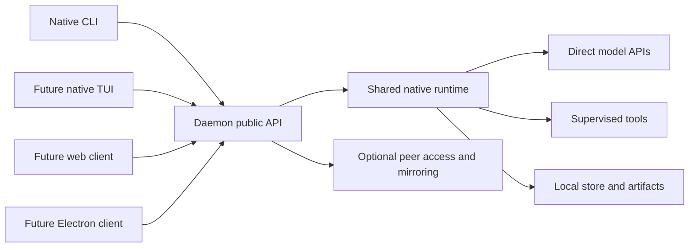
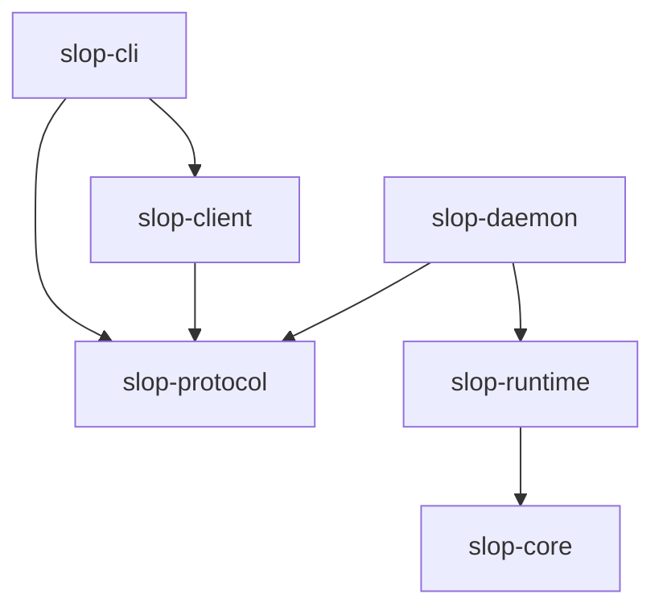

# Architecture

## Chosen shape

Each node runs one native Rust daemon. The daemon exposes a public API, owns the
local agent runtime, and stores its state locally. Clients send commands and
subscribe to events. They can disappear without taking accepted work with them.

Local ownership is independent of topology. A client can connect directly to an
owner, connect through an optional aggregate node, or later use another transport.
The same session and execution model applies in each case.

This is a logical diagram. There is one coordinating service on each machine,
with multiple asynchronous sessions and supervised tool processes.

## Initial workspace boundaries

| Crate | Owns | Must not own |
| --- | --- | --- |
| `slop-core` | Domain identities, transitions, budgets, ownership invariants | HTTP, SQL, provider SDKs, UI |
| `slop-protocol` | Versioned DTOs, error shapes, event envelopes, capability schemas | Runtime state or client rendering |
| `slop-runtime` | Agent loop, scheduling, tools, provider integrations, repository ports | CLI/TUI/web state |
| `slop-daemon` | Service composition, API handlers, configuration, startup/shutdown | Presentation logic |
| `slop-client` | Native API transport, compatibility, command/event convenience methods | Agent execution |
| `slop-cli` | Argument parsing, terminal formatting, script exit behavior | Scheduler, model calls, database access |

The domain and runtime crates are boundary scaffolds at M0. The protocol,
daemon, client, and CLI contain only the health/status vertical slice.

Arrows denote dependencies. Future native TUI code follows the CLI path.
A browser/Electron client consumes the HTTP contract, not Rust runtime internals.

## How code can grow

Keep provider and tool modules inside `slop-runtime` initially. Add dedicated
crates only when there is a concrete reason: independent reuse, build isolation,
a platform dependency, or a clearly owned subsystem. Candidate later packages
include `slop-store`, `slop-provider-openai`, and `slop-tui`.

Interfaces for storage and providers live beside the code that needs them.
The concrete local-store implementation is composed by the daemon. Core domain
objects do not acquire SQL connections or HTTP clients. Wire DTOs are translated
at service boundaries so changes to internal representations do not accidentally
become protocol changes.

The [shared provider interface](provider-interface.md) develops this boundary
into a proposed execution contract and a separate public DTO projection, with
capability discovery and criteria for adapter/client conformance.

A workspace is a source organization choice, not a runtime deployment boundary.
Several crates still compile into one daemon executable.

## Execution ownership

A node has a durable opaque identifier and a separate human-readable name.
Home/Linux and Home/Windows are different nodes, optionally grouped under one
physical-machine record. Reinstalling an OS or deleting its data directory needs
an explicit identity/import decision.

Each session records its owner node and an ownership epoch reserved for future
handoffs. The owner accepts session mutations and advances execution. Other
nodes can forward commands or store read-only replicated events.

Concurrent clients are supported by serializing mutating commands per session,
not by allowing several clients to race a shared mutable agent context. Commands
can be accepted concurrently, but the owner determines their order and rejects
stale preconditions where necessary.

## Runtime service composition

A daemon-wide Tokio runtime supplies asynchronous execution. Shared resources
include provider connection pools, admission controls, project registries, tool
implementations, and cache services. Per-session state is deliberately bounded.

Use an execution supervisor for each admitted run, a bounded inbox for its
commands, and a durable record of the current step. A supervisor is an async
task; it does not imply an OS thread or process per chat.

Blocking filesystem/database work and CPU-heavy parsing have explicit bounded
execution paths. A library call that blocks must not be put on the main async
scheduler without accounting for it.

## Service lifetime

The daemon eventually starts at login or boot according to installation policy:
a Linux service/user service and a Windows service or user startup integration.
M0 runs in the foreground; service installation is planned.

Only one daemon should own a given data directory. A later startup lock uses
OS-backed exclusivity rather than trusting a stale PID file. Multiple development
instances may run with distinct data directories and ports.

Startup eventually performs identity loading, schema checks, repository scans
limited to registered projects, and interrupted-run reconciliation. It must not
implicitly resume every recorded command.

Shutdown stops new admissions, requests active runs to checkpoint or interrupt,
drains bounded writes, and records remaining uncertain work. Tool cleanup is
bounded; inability to stop a process is reported rather than hidden.

## Data and artifact flow

Commands cross the API boundary into a durable command inbox. The service checks
identity, ownership, policy, and limits. It commits accepted state before
returning acknowledgement. Execution then emits semantic records.

Events are journal entries plus presentation-friendly projections. Clients can
receive transient token deltas, but durable message completion/checkpoints
establish the recoverable conversation. Artifacts hold large data with content
hashes and metadata; events reference them.

Local data remains authoritative even when the optional mirror is unavailable.
A mirror is not a second writer and is not allowed to infer permission to resume.

## Why Rust

Rust was selected after considering Go and C#. Its ownership model provides
explicit resource-lifetime control without a garbage collector. Tokio supports
the intended shared async session model. This does not guarantee low memory by
itself; retained histories, provider buffers, indexes, and tool processes must
still be bounded and measured.

The workspace uses Rust edition 2024, resolver 3, a committed lockfile, and a
stable toolchain. A minimum supported Rust version has not yet been established.
M0 dependencies are verified against the current installed toolchain.

The CLI is the default workspace member. Plain `cargo build` or `cargo run`
therefore selects the client; daemon builds use an explicit package selector.
Whole-workspace verification uses `--workspace`.

## Architectural invariants to test

1. Building the native client cannot require execution or frontend packages.
2. CLI exit leaves an accepted run alive.
3. Client reconnect neither loses committed events nor starts another attempt.
4. Retrying a command with the same identity cannot produce two tasks.
5. Several tasks cannot concurrently write one exclusive workspace.
6. An unknown tool outcome cannot silently become success or automatic replay.
7. Mirrored sessions remain read-only unless a handoff has committed.
8. Queued work does not reserve resources intended only for active execution.

See [protocol](protocol.md), [runtime](runtime.md), [storage](storage.md), and
[implementation](implementation.md) for the proposed mechanisms.
