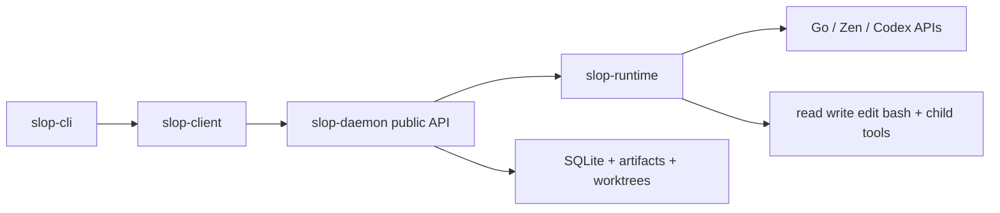
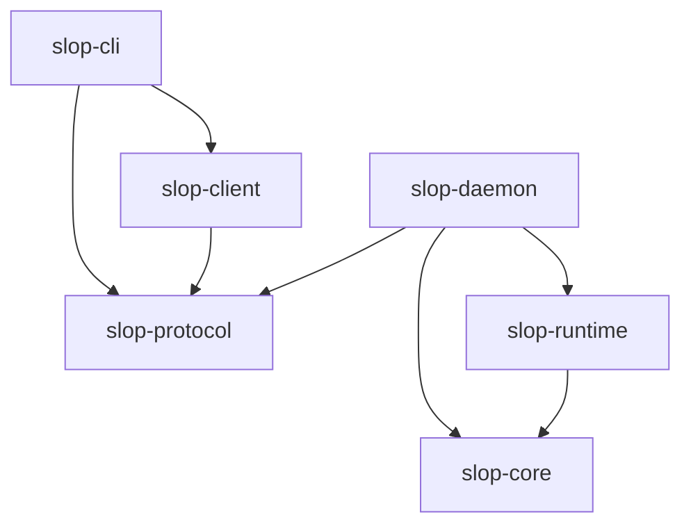

# Slop Conductor overview

**Status as of 2026-10-10.** This is the master high-level map. Detailed design
lives in the documents linked below; this file summarizes what exists today per
crate so a new developer can get oriented without reading everything first.

Slop Conductor is a native Rust AI agent runtime: one daemon per OS installation
owns sessions, agent execution, and local data. Clients (CLI first, TUI/web/
Electron later) attach over a versioned HTTP API, then detach without stopping
accepted work. The daemon calls model providers directly and supervises tools
itself. Each node owns its data; remote access and mirroring are future tracks.

Implemented local slice: loopback daemon + authenticated API, durable text chat,
structured Go/Zen tool execution (Codex text-only), registered projects with
managed Git worktrees, durable tasks/run attempts, deterministic batch matrices,
fair admission with aggregate budgets, batch cancellation, and bounded native
child tasks with durable waits. Linux and native Windows offline CI pass; live-
provider and release-build capacity validation remain outstanding. See
[native validation](native-validation.md).

## Workspace in one picture



Crate dependency direction:



Rules: clients never depend on `slop-runtime`/`slop-daemon`. `slop-core` and
`slop-protocol` have no presentation, networking, or persistence dependencies.
Native builds never require web/Electron toolchains.

## Per-crate overview

### `slop-core` — pure domain logic

Owns transport-independent identities, transitions, budgets, and ownership
invariants. No HTTP, SQL, provider SDKs, or UI.

Key files: `crates/slop-core/src/lib.rs`, `provider.rs` (provider/model
identity used by the runtime registry), `orchestration.rs` (task/batch/child
policy types).

Read with [architecture](architecture.md) and [requirements](requirements.md).

### `slop-protocol` — public wire contract

Owns versioned DTOs, error shapes, event envelopes, and capability schemas.
No runtime state or rendering.

Modules: `lib.rs` (health/node, chat/session/message/turn/event DTOs),
`execution.rs` (blocks, model requests, tool invocations, artifacts,
capabilities, per-turn model/settings), `projects.rs` (project/workspace DTOs),
`orchestration.rs` (tasks, runs, batches, delegation policies, parent/child
links, exact-attempt waits, budgets, batch cancellation receipts).

Every mutation carries a caller-chosen `command_id`. Repeating the same ID and
payload returns the original receipt; a different payload conflicts. This is how
scripts survive uncertain delivery without duplicating work.

Read with [protocol](protocol.md).

### `slop-runtime` — native execution

Owns the agent loop, scheduling, tools, provider integrations, and repository
ports. No CLI/TUI/web state.

Key areas:

- `providers/`: shared `ProviderClient` trait plus `opencode_go.rs`,
  `opencode_zen.rs`, `codex.rs`, `chatgpt_auth.rs`, shared OpenCode
  transport/decoder, structured wire translation. Go/Zen do text + structured
  tool turns across Chat Completions, Responses, and Messages. Codex does
  text-only turns via Platform keys or ChatGPT subscription login.
- `chat.rs` / `agent.rs`: turn supervisor, bounded admission, context assembly,
  streaming checkpoints, cancellation, steering (`after-turn`,
  `next-boundary`, `immediate`), durable pause/resume.
- `tools.rs`: native `read`, `write`, `edit`, `bash` with workspace policy,
  output bounds, deadlines, and process-group/Job Object cleanup.
- `git.rs`: supervised Git worktree allocation, frozen-base resolution,
  diff/status, conservative cleanup.
- `orchestration.rs`: task attempts, matrix admission, fair tickets, aggregate
  budgets, batch cancellation, child creation/waits with slot release.

Credentials never enter this crate from clients; the daemon resolves them.

Read with [runtime](runtime.md), [shared provider interface](provider-interface.md),
[structured execution](structured-execution.md), [tasks/batches](tasks-batches.md),
[child tasks](child-tasks.md).

### `slop-daemon` — service composition

Owns API handlers, configuration, startup/shutdown, storage composition, and
credential ownership. No presentation logic. Binaries: `slopd`.

Key areas: `main.rs` (startup order, health/node routes, shutdown),
`config.rs` (XDG/`LOCALAPPDATA` paths, loopback-only listener, TOML bounds),
`auth.rs` + `credentials.rs` (private bearer token, provider key/ChatGPT
storage), `api/chat.rs|providers.rs|projects.rs|orchestration.rs` (thin
handlers: authenticate, validate, invoke store/runtime, render DTO),
`storage*.rs` + `storage/` (bounded SQLite worker, schemas 1–8, transactions
that commit state + events + receipts together).

Health advertises: `health`, `node`, `sessions`, `text-chat`,
`provider-credentials`, `structured-messages`, `tools`, `per-turn-settings`,
`execution-steering`, `turn-pause-resume`, `managed-workspaces`, `tasks-runs`,
`orchestration-controls`, `child-tasks`, `batch-matrices`.

Data layout under `<data-dir>/`: `daemon.lock`, `state.sqlite3`,
`credentials/` (local token, Go/Zen/Codex keys, ChatGPT record),
`artifacts/` (content-addressed), `workspaces/<project>/<workspace>/`.

Read with [daemon startup](daemon-startup-plan.md), [storage](storage.md),
[text chat](text-chat.md), [provider credentials](provider-credentials.md), and
the [daemon guide](../crates/slop-daemon/slop-daemon-guide.md).

### `slop-client` — native API transport

Owns daemon request/response transport, compatibility checks, error
interpretation, bounded NDJSON decoding, and typed operations. No execution.

Files: `src/lib.rs` (endpoint/token selection, health/version checks, chat/
session/turn/artifact/provider calls), `src/orchestration.rs` (project/
workspace/task/run/batch/child calls).

The CLI and a future `slop-tui` share this crate. Browser clients use the HTTP
contract directly.

### `slop-cli` — scriptable frontend

Owns argument parsing, terminal formatting, and script exit behavior. No
scheduler, model calls, or database access. Binary: `slop`. Default workspace
member, so plain `cargo run` targets it.

Groups: `status`, `node`, `models`, `capabilities`, `artifact`, `provider`,
`chat`, `session`, `task`, `run`, `batch`, `project`, `workspace`, `turn`.
Supports `--json`, `--daemon`, `--token-file`/`SLOP_TOKEN_FILE`,
`--command-id` for idempotent retries, piped/stdin/file prompts, event
following with detach-on-Ctrl-C, and explicit cancel/pause/resume commands.

Read with [clients](clients.md).

## Main flows

1. **Accept, then execute.** `POST` with `command_id` commits state + events +
   receipt in one SQLite transaction and returns `202`. The scheduler admits
   the turn later under global/batch/fair/budget limits. Clients poll, follow
   NDJSON events, or detach.
2. **Stream safely.** Transient deltas carry no cursor. Bounded checkpoints and
   terminal records do. Reconnect from the last durable sequence and reconcile
   against canonical history.
3. **Recover without replay.** Restart marks in-flight turns interrupted,
   fails unfinished tools as `daemon_restarted` with `effects_unknown` where
   started, leaves queued/paused work alone, and never replays unknown side
   effects. Continue with a new message, explicit resume, or explicit retry
   into a fresh attempt.
4. **Isolate code work.** Register a repo, freeze its base commit at session
   acceptance, allocate a detached worktree after admission, expose diffs, and
   require explicit cleanup that refuses dirty files or new commits.
5. **Scale jobs.** Preview a `BatchSpec` (prompts × models × settings, max 256
   members), submit atomically, admit lazily, retry selected indexes only, and
   export JSON Lines results.
6. **Delegate.** An authorized parent creates children with explicit
   models/tools/context/budgets/depth, waits on explicit child run IDs while
   releasing its execution slot, and consumes bounded result previews.

## Providers, tools, and limits (current defaults)

- Providers: `opencode-go`, `opencode-zen` (text + tools), `codex` (text-only).
  Default model `opencode-go/glm-5.3-flash`. Select with
  `chat --model provider/model`. Keys via `provider set-key`; ChatGPT login via
  `provider login codex`. Saved keys beat stale env vars; active turns keep
  their snapshot.
- Tools: only `read`, `write`, `edit`, `bash`, plus separately authorized
  `child_create/inspect/wait/result/cancel`. No JS backend, no external agent
  CLI, no per-chat OS process.
- Representative bounds: 4 concurrent turns; 32 queued/session, 1024 global;
  256 messages / 1 MiB context; 1 MiB visible output; 32 calls / 16 model
  requests per workspace turn (max 128/64); 30 s shell default (max 300 s);
  200 rows/page; 256 projects/workspaces global, 32 workspaces/project; 1024
  active attempts; 8 attempts/task; batch 1–256 members, concurrency 1–16.

## Run and verify

```sh
cargo run -p slop-daemon
cargo run -- status
cargo run -- chat --prompt "Reply with a short greeting."
cargo fmt --all -- --check
cargo clippy --workspace --all-targets --locked -- -D warnings
cargo test --workspace --locked
python3 scripts/smoke.py
```

Windows uses `python`/`py -3`. CI runs the same offline suite on Ubuntu 24.04
and native Windows Server 2025 with no provider secrets.

## Where to read next

- Start: [documentation map](README.md), [product](product.md),
  [requirements](requirements.md), [architecture](architecture.md).
- Build slices: [text chat](text-chat.md),
  [structured execution](structured-execution.md),
  [projects/workspaces](projects-workspaces.md),
  [tasks/batches](tasks-batches.md), [child tasks](child-tasks.md).
- Cross-cutting: [protocol](protocol.md), [runtime](runtime.md),
  [storage](storage.md), [provider credentials](provider-credentials.md),
  [Codex connection](codex-connection.md), [roadmap](roadmap.md),
  [implementation](implementation.md), [native validation](native-validation.md),
  [open questions](open-questions.md), [decisions](decisions/README.md).

No documentation files were removed: every file under `docs/`, `crates/`,
`clients/`, and `examples/` is referenced from the map above or from a crate
guide and describes either implemented behavior, an accepted constraint, or an
explicit proposal/future track.
