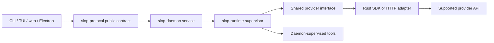

# Shared provider interface

**Status: proposed implementation guidance, 2026-10-08.** This document defines
the target contract for provider integrations and the common surface the daemon
will expose to clients. The full `ProviderAdapter` contract and account/capability
DTOs/endpoints remain proposed; basic [credential endpoints](provider-credentials.md)
are implemented. The implemented one-turn subset is described
below. The [requirements](requirements.md) and [crate boundaries](architecture.md)
remain authoritative; the specific target types and operations are a draft.

Read this with the [runtime](runtime.md), [public protocol](protocol.md),
[storage](storage.md), and [implementation plan](implementation.md) before
implementing a provider or a client-facing model feature.

## Purpose

Every provider should plug into one native execution interface. The daemon
should turn its output into the same messages, tool proposals, usage records,
errors, and lifecycle events, so CLI, TUI, web, and Electron clients can share
one public contract.

An OpenAI-compatible or Anthropic-compatible SDK is a transport implementation
choice inside an adapter. Its request objects and events are not the daemon's
domain model or public API. Compatibility with an API shape does not establish
support for every model feature, setting, authentication method, or operation.

The shared surface preserves provider differences through explicit capabilities
and validated extensions. It must not silently flatten a structured response
into text, discard unsupported settings, or imply that every provider supports
the same features.

## Current implementation and gap

The repository currently contains:

- [Provider identities](../crates/slop-core/src/provider.rs) in `slop-core`.
- A [runtime registry and `Provider` trait](../crates/slop-runtime/src/providers/mod.rs)
  covering metadata, a static model catalog, and wire-protocol lookup.
- Concrete [OpenCode Go](../crates/slop-runtime/src/providers/opencode_go.rs) and
  [OpenCode Zen](../crates/slop-runtime/src/providers/opencode_zen.rs) clients
  with live model listing, non-streaming inference, and SSE text streaming over
  three wire shapes. Each supplies its own metadata, catalog, and credential
  variable to a [shared internal transport/decoder](../crates/slop-runtime/src/providers/opencode.rs).
  Runtime callers supply keys explicitly or from the environment. The daemon
  owns [runtime credential configuration and private XDG storage](provider-credentials.md).
- A [headless Codex client](../crates/slop-runtime/src/providers/codex.rs)
  through the public Responses API, with native ChatGPT subscription login,
  protected credential records and serialized token refresh. Platform API keys
  are also supported. See [Codex connection](codex-connection.md) for setup and
  the implemented restrictions.
- An object-safe `ProviderClient` execution trait for validation, model listing,
  non-streaming and streaming one-turn inference. Its boxed futures are `Send`
  and use the shared runtime; all three concrete clients implement it.
- Small neutral types for string messages, requests, responses, text/reasoning
  deltas, explicit completed/incomplete outcomes, optional token counters with
  total provenance, and separate requested/reported model identifiers.

This is a starting point. It does not yet implement structured tools/content,
account capability discovery, the cancellation contract, continuation persistence,
or the full public provider surface described here. Basic credential setup,
status and ChatGPT login endpoints are implemented in the linked credential
guide. The text-only adapter rejects
unsupported tool/non-text output and required opaque continuation instead of
silently discarding it. Empty reasoning metadata can accompany text; legacy
Chat reasoning deltas remain transient runtime data, not the public summary
capability proposed below.

The current decoders require recognized terminal evidence, preserve incomplete
outcomes, distinguish unknown usage from reported zero, and enforce bounded
UTF-8/SSE framing. HTTP redirects and transport retries are disabled; HTTP error
bodies are excluded from diagnostics. These changes bring the one-turn subset
closer to the target contract without claiming a complete daemon execution API.

Direct OpenAI and Anthropic identity variants remain reserved. Codex is
registered alongside OpenCode Go and Zen. Authentication modes are exposed
through the shared descriptor/client interfaces. `ChatRequest.max_tokens` is
optional: both OpenCode clients require `Some(limit)`; ChatGPT plan usage
requires `None` and rejects an explicit cap. Developer messages retain their
role on Responses/Chat and are rejected for Anthropic Messages. Subscription
requests reject system messages instead of changing their priority; use an
explicit developer role. All three clients share the bounded wire decoders.
The daemon implements anonymous health and authenticated node, Go text-chat,
and provider credential APIs. Codex/Zen runtime adapters and saved credentials
do not imply those providers support daemon session execution.

### Implemented OpenCode adapters

| Adapter ID | Base URL | Credential environment variable |
| --- | --- | --- |
| `opencode-go` | `https://opencode.ai/zen/go/v1` | `OPENCODE_GO_API_KEY` |
| `opencode-zen` | `https://opencode.ai/zen/v1` | `OPENCODE_ZEN_API_KEY` |

The Zen key comes from the OpenCode Zen account. This project uses its own
explicit variable name; it does not fall back to `OPENCODE_API_KEY` or the Go
key. Both clients also accept an explicit key through `new`.

Both implement the same `Provider` metadata and `ProviderClient` execution
contracts. For example, runtime code can put an authenticated
`OpencodeZenClient::from_env()?` in a `Box<dyn ProviderClient>` and call
`validate`, `list_models`, `complete`, or `complete_streaming` without parsing
Zen transport objects. The static registry resolves `ProviderId::OpencodeZen`;
provider/model references use `opencode-zen/<model-id>`.

The Zen execution catalog follows its documented endpoint table, checked on
2026-10-08. MiniMax M3/M2.7 and Qwen3.8 Max use Chat Completions on Zen, while
they use Messages on Go. The adapter keeps these mappings separate. Advertised
IDs outside the execution catalog remain visible in `list_models`, but fail
validation before dispatch. Zen's Gemini/Google and Jev/System One formats are
unsupported. Account-scoped capabilities, tools, structured output,
continuation, and Zen daemon execution remain proposed. Go now supplies the
daemon's [durable text-chat slice](text-chat.md), including cancellation and
public history/event replay.

Local HTTP fixtures exercise both adapters through `dyn ProviderClient` across
all three wires, including terminal/incomplete results, auth and session
headers, model listing, safe failures, and disabled retries/redirects. No live
Zen inference was performed. An optional budgeted check is available:

```sh
# Set OPENCODE_ZEN_API_KEY explicitly before opting in.
cargo test -p slop-runtime --test opencode_zen_live --locked -- --ignored
```

That suite makes one model-list request and six inference requests, each with a
512-output-token cap. These caps do not bound billing. Default tests use local
fixtures and leave all live tests ignored.

## Boundaries and ownership



There are two related contracts: a runtime interface for adapters and a public
wire contract for clients. The daemon maps between them; neither contract
serializes SDK objects or exposes runtime trait objects.

| Layer | Responsibility |
| --- | --- |
| `slop-core` | Pure identities and execution invariants; no HTTP, SDK, credentials, or rendering dependencies. |
| `slop-runtime::providers` | Shared execution types, capability validation, transport translation, normalized streams/errors, and opaque continuation handling. |
| Runtime supervisor | Context assembly, request intent, admission/budgets, retry decisions, persistence, cancellation ordering, tool authorization and dispatch. |
| `slop-daemon` | Compose adapters, endpoint/account configuration and credential resolution; map runtime facts into API DTOs. |
| `slop-protocol` | Versioned discovery, content, event, error, and configuration DTOs independent of runtime dependencies. |
| Clients | Discover capabilities, submit commands, render canonical data, and reconnect through the public API. |

Adapters are compiled in, following the current registry. This proposal adds no
dynamic plugin mechanism. Connection pools and account admission are shared
across sessions. All execution stays in the daemon's Rust runtime; provider SDKs
must not require a JS backend, an external agent CLI, or a process per chat.

A Rust SDK may handle HTTP/auth framing and parsing if it fits these boundaries.
Any SDK-owned retries, tool execution, context truncation, or agent loop must be
disabled or explicitly controlled by the daemon. When an SDK cannot preserve the
contract, use a Rust HTTP implementation for that part.

## Runtime operations

Each integration implements the following operations through a shared,
object-safe interface. The names are illustrative; their responsibilities are
the contract.

| Operation | Input and result | Required behavior |
| --- | --- | --- |
| `descriptor` | Local `ProviderDescriptor` | Stable provider ID, display name, supported auth modes, adapter version. No network access or secrets. |
| `account_status` | `AccountRef`, cancellation/deadline; `AccountStatus` | Bounded local check or documented provider probe. Report readiness, safe reason, observation time, and whether status is locally known or remotely verified. |
| `discover` | `AccountRef`, cancellation/deadline; `ProviderCatalog` | Account/endpoint-scoped models and capability snapshots, with observation time, revision and provenance. Bound/cache discovery; disclose stale data. |
| `validate` | `TurnRequest`, matching catalog snapshot; `PreparedTurn` or failure | No network calls or execution. Validate all requested features/settings/context; resolve configuration and record effective values. |
| `start` | Single-use `PreparedTurn`, `RequestControl`; `ProviderStream` | Start one inference attempt and emit normalized events. Honor cancellation/deadlines; perform no hidden retry or local tool execution. |

A schematic Rust shape makes the execution boundary explicit:

```rust,ignore
// Design sketch only. Supporting types and async aliases are not implemented.
trait ProviderAdapter: Send + Sync {
    fn descriptor(&self) -> ProviderDescriptor;
    fn account_status<'a>(
        &'a self,
        account: &'a AccountRef,
        control: RequestControl,
    ) -> ProviderFuture<'a, AccountStatus>;
    fn discover<'a>(
        &'a self,
        account: &'a AccountRef,
        control: RequestControl,
    ) -> ProviderFuture<'a, ProviderCatalog>;
    fn validate(
        &self,
        request: TurnRequest,
        catalog: &ProviderCatalog,
    ) -> Result<PreparedTurn, ProviderFailure>;
    fn start(&self, turn: PreparedTurn, control: RequestControl) -> ProviderStream;
}
```

`ProviderFuture` denotes a boxed, `Send` asynchronous result, and `ProviderStream`
an owned, `Send` stream of `ProviderEvent`. Returning a stream does not mean an
upstream request has been accepted. Network/start failures appear as terminal
stream outcomes. The stream must not borrow a client connection or hold a lock
across a network wait.

`RequestControl` carries a daemon-owned cancellation signal and deadlines.
`PreparedTurn` is bound to its adapter/account/endpoint and capability revision;
another adapter cannot consume it. Resolve credentials through daemon-owned
account services, not from client-supplied inference headers.

One stream represents one model request, not an entire conversation or agent
run. A non-streaming upstream can emit canonical blocks followed by a terminal
result through this interface. Advertise that it has no incremental streaming.

## Identity, discovery, and capabilities

Keep these identities separate:

| Identity | Meaning |
| --- | --- |
| Provider ID | Integration/service identity, such as the current `opencode-go`. |
| Account handle | Opaque owner-local credential/account reference; never the secret itself. |
| Endpoint configuration ID | Which configured service/deployment is used. A wire-compatible gateway is still its own configured destination. |
| Requested / resolved model ID | User selection and the actual model when known. Treat identifiers as opaque; an alias may resolve differently later. |
| Wire protocol | Adapter-private translation choice, such as Chat Completions, Responses, or Messages. |
| Run / model-request ID | Daemon execution attempt and its individual inference request. Distinct from public command IDs and upstream response IDs. |

Capability snapshots are scoped to provider, account, endpoint configuration,
model, and adapter version. Include a revision, observation time, and source
(`static`, `configured`, or `discovered`). A provider-wide descriptor alone is
insufficient: models and account access can differ within the same integration.

Separate feature support from current availability. An adapter can support
tools while an account needs authentication or is rate limited. A discovered
model without a verified adapter mapping is visible as unavailable for execution;
do not guess its wire protocol from its name. A reserved provider ID is not an
available integration.

Use explicit feature support states: `supported`, `unsupported`, and `unknown`.
Unknown is not permission to execute. A supported feature with restrictions
includes those restrictions; an unavailable or unsupported feature includes a
safe reason clients can show.

The initial capability schema must describe:

- Input/output content kinds, supported instruction roles, context/output
  limits with units, and whether limits are known or estimated.
- Incremental streaming, local tool proposals/results, parallel tool proposals,
  supported tool-schema subset and tool-choice modes, and structured output.
- Accepted generation settings, including supported reasoning controls where
  applicable. Reasoning controls and displayable reasoning summaries are
  separate capabilities; no hidden reasoning disclosure is assumed.
- Cancellation behavior (`local_abort` or verified `remote_cancel`), any
  documented response retrieval, continuation requirements, and replay support.
- Usage counters, quota visibility, and auth modes that are actually implemented
  for this integration. API compatibility does not grant subscription access.

Each setting descriptor includes a stable key, label/description, type, allowed
values or range, units, omission/default semantics, and conditional constraints.
For example, `temperature` may be a supported numeric setting on one model and
unsupported on another; its presence cannot be inferred from the wire shape.
Clients can render ordinary controls from descriptors without matching provider
names. The daemon remains responsible for validation.

Discoverable extensions use registered, namespaced keys, explicit schemas,
limits, and adapter versions. They are validated typed configuration, not an
arbitrary JSON body or header escape hatch. Adding an extension must leave common
text/tool workflows usable by a client that does not offer that control.

## Request validation and effective configuration

`TurnRequest` contains execution identities, an account/model selection,
instruction/messages, tool declarations and tool-choice policy, generation
settings, response-format requirements, and any eligible continuation reference.
It carries artifact references rather than unrestricted paths or unbounded
inline attachments. Authorization and artifact resolution remain daemon-owned.

Before network dispatch, `validate` must check the matching capability snapshot,
required auth configuration, roles/content, tool/result pairing, settings and
combinations, attachment types/sizes, continuation compatibility, and declared
request/context limits. Estimates must be labeled; they cannot guarantee that
the upstream will accept a context. The supervisor separately checks current
account readiness, authorization, budgets, and admission.

Unsupported or unknown explicit settings fail with a field path and stable
reason. Do not clamp values, merge distinct instruction roles, drop attachments,
replace models, or choose another account silently. Fallback or lossy context
conversion requires a separately selected, recorded policy and validation of
the resulting request.

`PreparedTurn` records requested and resolved model selection, requested settings,
effective settings, capability revision, and context provenance. For each
effective setting, record whether it is user-specified, a daemon default, an
adapter default, or an upstream default whose value may be unknown. Do not
invent an exact value for an undocumented upstream default. If the response
reveals a different resolved model, preserve both observations.

Queued work is revalidated when admitted against current configuration/access.
If its recorded choice has become invalid, report the failure instead of
changing the experiment. Capability discovery is advisory, not a guarantee that
auth, quota, or model availability cannot change before dispatch.

## Canonical content and tool proposals

The neutral conversation is structured content, not `role` plus one string.
Messages and blocks have stable daemon identities and explicit completion
status. Preserve block order and provider call identities through translation.
Keep system instructions, developer instructions where supported, user messages,
assistant messages, and tool-result authorship semantically distinct. An adapter
rejects unsupported roles rather than silently converting their priority.

| Content kind | Canonical information |
| --- | --- |
| Text | Text and completion status. |
| Attachment | Authorized artifact reference, media type, size and applicable modality metadata. |
| Tool proposal | Stable local call ID, original provider call ID, tool name, complete parsed arguments, and validation status. |
| Tool result | Reference to its local call ID, success/error status, structured result or artifact references, and bounded preview. |
| Refusal | Explicit refusal with provider-supplied safe explanation when available; distinct from a transport error. |
| Reasoning summary | Only supported displayable summary content; signatures/opaque continuation fields stay separate. |
| Extension | Namespaced/versioned kind, safe display summary and bounded artifact reference; preserve semantics or reject unsupported input. |

Map tool-call identities using the request scope plus provider call ID; do not
assume a provider's IDs are globally unique. A durable tool invocation has its
own daemon ID and links back to the proposal. Include tools/results in subsequent
context with the pairing and order required by the selected adapter.

Tool argument deltas are provisional bytes. Execute nothing until the entire
response has a recognized successful terminal outcome, the proposal is complete,
arguments parse and satisfy the tool schema, and the supervisor has authorized
and durably recorded the invocation. A completed block alone is insufficient.
Output-limit, canceled, malformed, or interrupted responses cannot trigger tools.

An adapter proposes local tool calls; it never executes them or makes policy
decisions. Hosted/provider-side tools are a separate future capability with
explicit side-effect and recovery semantics, disabled unless implemented and
authorized. An SDK must not enable them implicitly.

## Normalized streaming and completion

`ProviderEvent` is independent of SSE framing and SDK event names. Every event
belongs to one model-request ID. Blocks have stable IDs; delta frames have a
stream ID and monotonically increasing chunk index for client deduplication.

| Event | Meaning |
| --- | --- |
| `request_started` | Adapter attempt has started; upstream acceptance is not implied. Upstream IDs are added when known. |
| `block_started` | Content block identity/kind/order announced. |
| `block_delta` | Typed provisional text, summary, or tool-argument fragment for that block. |
| `block_completed` | Canonical block value assembled and validated structurally; still not authorization for a tool. |
| `usage_updated` | Best-known cumulative counters for this request, with measurement status. |
| `request_finished` | Exactly one terminal outcome, canonical content, usage, finish reason and safe continuation metadata. |

Emit `request_started` first, then zero or more block/usage events, then exactly
one `request_finished`. Different blocks may be interleaved by ID. Emit no semantic
events after the terminal event; any final usage belongs in that event. Keepalive
frames and harmless SDK bookkeeping remain internal.

Terminal outcomes are `completed`, `failed`, `canceled`, and `interrupted`.
Completed requests carry a finish reason such as `stop`, `tool_calls`,
`output_limit`, or `refusal`, and content completeness. A turn ending with tool
proposals is not a completed task. Output-limit termination may preserve partial
text but must not label it a complete answer.

A completed outcome requires recognized upstream terminal evidence. EOF,
HTTP success, plausible text, or valid-looking partial JSON is insufficient.
If the stream closes without a terminal outcome, the supervisor synthesizes an
interrupted result and retains known partial visible content while discarding
interrupted thinking. Unknown provider events
may be ignored only when known to be nonessential; unsupported content or an
unrecognized completion shape fails explicitly.

Persist request intent before dispatch. The supervisor turns normalized events
into transient deltas, durable partial checkpoints, and a transactionally
committed terminal record as described in [protocol](protocol.md) and
[storage](storage.md). Provider events do not allocate durable session sequence
numbers. Transient frames do not advance replay cursors.

The terminal record is authoritative. A client replaces provisional content by
block/message ID when a checkpoint or terminal record arrives, preventing text
duplication after reconnect. Replaying history never calls the provider.

## Errors, cancellation, and retry ownership

`ProviderFailure` contains a stable normalized code, safe message, affected field
when applicable, upstream request ID if known, optional HTTP status and retry
delay, dispatch state (`not_sent`, `sent`, `unknown`), and whether partial output
exists. Raw SDK error strings, response bodies, and credentials are not public
diagnostics. Bounded size alone does not make an error body safe to expose.

| Failure class | Meaning and default disposition |
| --- | --- |
| Invalid request / unsupported capability | Fix input or configuration; no automatic retry. |
| Authentication required / permission denied | Refresh or correct account access; no inference retry loop. |
| Rate limited / quota exhausted | Distinguish temporary throttling from depleted quota; report safe retry timing when known. |
| Timeout / unavailable | Supervisor may retry only under bounded policy after checking dispatch, partial output and side effects. |
| Invalid response / unsupported response content | Preserve safe diagnostics; never fabricate a complete message. |
| Resource limit | Name the exceeded byte/token/buffer/deadline limit; preserve partial output as incomplete. |
| Context incompatible | Require explicit reconstruction or selection of a compatible provider/account/model. |
| Canceled / interrupted | Preserve accepted control and partial state; do not resume silently. |
| Unknown provider failure | Safe generic failure with known evidence; do not assume retry is harmless. |

Map these into the public error vocabulary centrally, including existing
proposals such as `unsupported_capability`, `provider_auth_required`,
`provider_rate_limited`, and `recovery_required`. Stabilize missing public codes
with protocol changes; clients never branch on an SDK exception type.

The adapter reports a retry disposition (`never`, `policy_may_retry`, or
`reconcile_first`) with evidence. The supervisor alone decides whether and when
to retry, using backoff, attempt/elapsed-time budgets, and admission limits. Each
retry has a new model-request ID and a link to the previous attempt. It does not
create a second public command or blindly rerun completed tools.

Interrupted thinking is discarded. An unknown inference outcome may have
consumed quota even when no local tool ran.
Remote retrieval or idempotency is used only where the adapter explicitly supports
it. If provider-side effects are possible, reconcile before retry. No unknown
tool operation is automatically replayed. An unfinished tool after daemon/process
failure is recorded as failed with that cause and any uncertainty about effects;
it is not restored. The agent decides its next action using that recorded result.

Cancellation is a daemon command: persist acceptance, signal the active request,
stop admitting new work, and record the observed terminal state. Serialize the
race with completion: a confirmed response may finish before cancellation
applies; retain that fact while preventing subsequent tool dispatch/turns.
Keep cancellation accepted, applied, and upstream acknowledgment distinct.

`local_abort` means the daemon stopped waiting/reading, not that the provider
stopped computing or charging. `remote_cancel` requires documented support and
records whether acknowledgment was observed. Neither client disconnect nor
dropping a UI subscription is a cancellation signal. A bounded cancellation
timeout records the remaining uncertainty and releases local resources safely.

## Usage, resource bounds, and continuation

Usage fields are optional counters with provenance (`reported`, `derived`, or
`estimated`) and completeness (`partial` or `final`). Missing is unknown, not
zero. Normalize stream updates into cumulative request snapshots, merging newly
reported fields; consumers replace known values rather than summing every event. Retries retain
separate usage records, including attempts whose final usage is unknown.

Keep input, output, total, cached-input, cache-write, and reasoning counters
separate when supported. Document whether detailed counters are subsets of other
counters; do not double-count them. A locally derived total is marked derived.
Cost estimates carry currency, pricing source/version and observation time;
subscription quota is separate from price and neither is an unconditional hard
billing cap. Unknown metrics stay unknown in UI and aggregate results.

Bound request bytes, attachment bytes, context assembly, SSE/event buffers,
individual blocks/tool arguments, retained output, event channels, request
duration and cancellation cleanup. Stream large content into bounded artifact
storage. Reaching a limit produces an explicit incomplete/failure outcome, not
silent truncation or continued unbounded allocation. Slow clients do not hold up
provider consumption indefinitely.

Opaque continuation data belongs to an owner-side, size-bounded, versioned
envelope scoped to provider/account/endpoint/model as required by the adapter.
Preserve required response IDs, signed fields and encrypted/opaque blocks without
displaying or interpreting them. Credentials are never continuation data.

The public API exposes only a safe reference and compatibility summary:
continuation is optional/required, and a proposed switch is compatible, requires
context reconstruction, or is blocked. Keep canonical conversation/artifacts
locally for supported reconstruction. Provider/account/model changes and exports
validate these requirements; opaque data is never passed to a different provider
or dropped silently to make a switch appear portable.

## Public surface for every client

The proposed `/v1/capabilities` and `/v1/models` queries expose safe discovery
DTOs. Existing session/task/run/message/event proposals carry selected
provider/account/model references, requested/effective configuration, structured
content, usage and normalized outcomes. This document adds no separate
provider-specific conversation routes. Exact DTO and route details stabilize
with implementation in `slop-protocol`.

All clients must be able to perform the same common workflow:

1. Discover configured accounts/models, support restrictions and current readiness.
2. Select a model and settings from descriptors; submit through daemon validation.
3. Show the run's actual model, effective settings, status and safe failure reason.
4. Render text, tool proposals/results, artifacts and usage from canonical DTOs.
5. Observe accepted/applied cancellation or steering through the same lifecycle.
6. Reconnect from snapshots/cursors without provider access or another inference.

Optional provider extensions can have richer rendering, with a generic bounded
summary/artifact fallback. Unknown additive public events still advance durable
cursors as specified by the protocol; unknown content must not crash rendering.
Preserve core execution/status meaning across compatible clients. New incompatible
required behavior needs API version handling, not an extension that older clients
will unknowingly misinterpret.

Wire schemas and native SDKs come from `slop-protocol`, never an upstream SDK or
runtime struct. Health, configured auth, account readiness, model support and
available admission capacity are separate facts. A client should not need a
provider-name condition to implement the common workflow.

## Criteria for a well-defined implementation

An integration satisfies this contract only when each applicable criterion has
observable evidence. Unsupported features pass by accurate declaration and
rejection, not by claiming simulated parity.

| ID | Criterion | Required evidence |
| --- | --- | --- |
| C01 | Execution uses the common adapter interface. | Supervisor can choose at least two adapters without concrete-provider branches; deterministic fake adapters suffice before a second live integration. |
| C02 | SDK/wire details stay behind the boundary. | Native client dependency check passes; protocol DTOs contain no SDK types, raw headers, or secret fields. |
| C03 | Discovery has explicit scope and freshness. | Fixtures distinguish supported, unsupported, unknown, stale catalog, unavailable account, and reserved provider identities. |
| C04 | Explicit configuration is preserved or rejected. | Unsupported values/combinations fail before dispatch with field details; recorded requested/effective settings explain defaults. |
| C05 | Content survives translation. | Role/block/order and tool-call/result fixtures round-trip without losing call IDs; unsupported content fails explicitly. |
| C06 | Completion has terminal evidence. | Valid streams produce exactly one terminal outcome; premature EOF/malformed completion preserves partial content as interrupted/failed. |
| C07 | Streaming framing is robust and bounded. | Fixtures split UTF-8 and frames across chunks, interleave blocks, and exceed limits; no corruption or unbounded buffering. |
| C08 | Tool proposals cannot execute prematurely. | Partial arguments, output-limit termination, malformed input and cancel races launch no tool; authorized completed proposals dispatch once. |
| C09 | Cancellation semantics match advertising. | Tests distinguish local abort, confirmed remote cancellation, completion race, timeout and client detach. |
| C10 | Retry policy is centralized and observable. | Fault injection proves no SDK retry, separate request IDs/usage for retries, bounded attempts, and no replay of unknown tools. |
| C11 | Unknown usage stays unknown. | Missing/partial/cumulative/final/subset-counter fixtures do not invent zeros or double-count; unknown retry usage remains visible. |
| C12 | Diagnostics and continuation are safe. | Synthetic secrets in headers/error bodies never reach public DTOs/logs; incompatible continuation is blocked and required fields survive restart. |
| C13 | Replay reconstructs the same view. | Snapshot + durable events reconcile streamed blocks by ID without duplicate text or new inference; a slow/disconnected client does not stall the run. |
| C14 | Clients use one semantic surface. | The same transcript/config/error fixtures drive a CLI projection and a second minimal protocol consumer with no provider-specific parsing. No full graphical client is required. |
| C15 | Advertised capabilities have implementation evidence. | Adapter fixtures cover each claimed feature; separately budgeted live checks establish supported real-provider behavior when credentials are available. |

## Implementation sequence for agents

1. Read the linked designs and inspect the current provider types. Identify which
   criterion the change addresses and label remaining gaps as proposed.
2. Introduce shared runtime execution/content/capability types and deterministic
   fake adapters. Keep domain invariants and public DTOs in their owning crates.
3. Grow the current `ProviderClient` into the target interface, retaining OpenCode
   Go and Zen's existing catalog/wire mappings. Preserve the implemented text, terminal,
   safe-error, optional-usage and bound behavior; add explicit capability
   discovery and cancellation. Declare other features unsupported until shipped.
4. Wire a persisted one-turn daemon request through the supervisor, then map its
   canonical data to `slop-protocol`. This depends on the planned identity,
   storage and authenticated API work; provider refactoring alone is insufficient.
5. Add structured tools/context/continuation incrementally, with failure and
   recovery fixtures before enabling side effects. Add another adapter early
   enough to expose assumptions tied to the first integration.
6. Expose capability-driven configuration and canonical rendering to the CLI;
   verify a second protocol consumer. Later UI surfaces build on that contract.
7. Update implementation status and affected documents with what actually ships.
   Run formatting, Clippy with denied warnings, relevant behavioral checks, and
   the bootstrap smoke check. Live provider checks require an explicitly selected
   credential and test budget; use synthetic fixtures without secrets for CI.

The async utility crates, precise DTO field names, discovery cache policy, and
broader account discovery are implementation choices still to resolve. Record
them when needed. They do not change the ownership, validation, completion,
capability, or client-independence requirements above.

## Conformance review of the current slice

This review covers the integrated one-turn code, not the future session service.
The [provider surface fixtures](../crates/slop-runtime/tests/provider_surface.rs)
exercise the shared trait with both real clients rejected before network dispatch
and a deterministic fixture adapter. Decoder regression fixtures live in the
shared OpenCode implementation, and
[local HTTP fixtures](../crates/slop-runtime/src/providers/opencode/http_tests.rs)
exercise both concrete adapters with the same consumer. Live checks also use
the shared trait and are ignored by default; their documented opt-in command requires a credential and
names the request/output-token bounds.

Live OpenCode Go verification on 2026-10-08 passed all seven opt-in checks using
the supplied temporary credential through `Box<dyn ProviderClient>`: model discovery and both
non-streaming and streaming turns for `glm-5.3-flash` (Chat Completions),
`claude-haiku-5-5` (Messages), and `gpt-6-luna` (Responses). Checks assert the
requested model, expected wire shape, completed outcome and nonempty text;
non-streaming turns also require reported/derived token usage, while streaming
turns verify that visible deltas reproduce the assembled text. This verifies the
runtime adapter. The daemon now exposes authenticated durable Go text chat,
session/history/event queries, and cancellation through the same native adapter.
The bounded Go streaming check was repeated for this slice with the supplied
temporary credential.

Zen live checks remain opt-in and have not been run. Codex local HTTP/auth
fixtures cover both authentication modes, subscription request restrictions,
loopback login, signed ID tokens, credential storage and refresh rotation. No
live Codex login or inference was performed; see [Codex connection](codex-connection.md).

| Criteria | Current evidence and remaining gap |
| --- | --- |
| C01–C02 | Shared object-safe execution interface, three concrete adapters, local HTTP fixture consumers, independent client dependencies, and a persisted bounded Go text-turn supervisor. |
| C03–C04 | Static model validation, bounded requests, requested/reported model identities, and rejection of multiple/non-leading Messages system instructions. Account-scoped discovery and general setting descriptors remain planned. |
| C05–C08 | Text-only parsers reject unsupported structured output, missing/unknown terminal evidence, malformed JSON/UTF-8, contradictory outcomes and post-terminal text. Regression fixtures cover trailing end markers, incomplete stop reasons, multiline framing, and chunk splits. Structured blocks and tool dispatch remain planned. |
| C09–C10 | HTTP retries/redirects disabled; no adapter tool execution. Go chat has durable turn intent and explicit cancellation; interrupted requests are not automatically retried. Tools and broader retry policies remain planned. |
| C11–C12 | Unknown/zero usage is distinct, cumulative updates do not double-count, reported totals retain provenance, and upstream error bodies are excluded. Go chat persists counters/provenance and reconciles interrupted turns on restart. Required unsupported continuation is rejected. Detailed counters and durable continuation remain planned. |
| C13–C15 | Common synthetic and HTTP consumers verify adapter results, terminal outcomes, wire translation, and `Send` futures. The real daemon/CLI fixture verifies Go chat detach, durable replay, command deduplication, cancellation, and restart history. Separately budgeted Go live adapter checks passed across all three wire shapes; Zen and Codex live checks remain opt-in and unverified. Structured-block replay remains planned. |

## Decoder references

The transport-specific regression assumptions were checked on 2026-10-08 against
these primary references. They describe API shapes; they do not establish every
compatible gateway's model capabilities or account access.

- [OpenAI Chat Completions streaming events](https://developers.openai.com/api/reference/resources/chat/subresources/completions/streaming-events)
  define finish reasons and optional request-level usage. The
  [create reference](https://developers.openai.com/api/reference/resources/chat/subresources/completions/methods/create)
  shows a usage chunk can precede the final `[DONE]` marker.
- [OpenAI Responses streaming events](https://developers.openai.com/api/reference/resources/responses/streaming-events)
  distinguish completed, incomplete and failed responses and carry canonical
  response objects in terminal events.
- [Anthropic streaming messages](https://platform.claude.com/docs/en/build-with-claude/streaming)
  describes block events, the message-delta stop reason, cumulative usage and
  final message-stop event.
